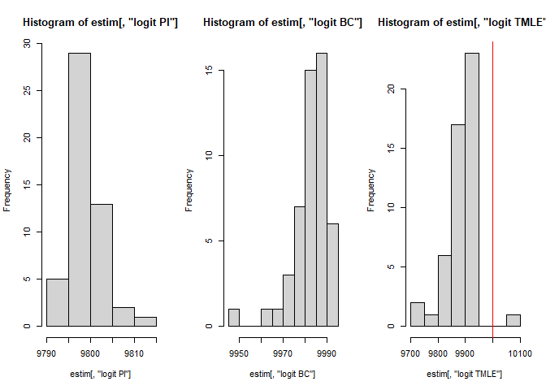

<!-- README.md is generated from README.Rmd. Please edit that file -->

# crctmle

<!-- badges: start -->

<!-- badges: end -->

The goal of crctmle is to provide users doubly-robust and efficient
estimates of population size and the variances for a capture-recapture
problem.

## Installation

You can install the released version of crctmle from
[CRAN](https://CRAN.R-project.org) with:

``` r
install.packages("crctmle")
```

And the development version from [GitHub](https://github.com/) with:

``` r
# install.packages("devtools")
devtools::install_github("mqnjqrid/crctmle")
```

## Example

This is a basic example which shows you how to solve a common problem:

``` r
library(crctmle)

data = matrix(sample(c(0,1), 2000, replace = TRUE), ncol = 2)
x = matrix(rnorm(nrow(data)*3, 2,1), nrow = nrow(data))
datacrc = cbind(data, x)

options(warn = -1)
estim <- psinhat(List_matrix = datacrc, func = c("logit"), nfolds = 2, K = 2)
# The population size estimates are obtained by
estim$n
#>      logit PI logit BC logit TMLE
#> 1, 2  991.988 931.4115   989.0861
# The corresponding variances are
estim$varn
#>      logit PI logit BC logit TMLE
#> 1, 2  1173.19 1079.853   1020.574
## basic example code
```

What is special about using `README.Rmd` instead of just `README.md`?
You can include R chunks like so:

``` r
summary(cars)
#>      speed           dist       
#>  Min.   : 4.0   Min.   :  2.00  
#>  1st Qu.:12.0   1st Qu.: 26.00  
#>  Median :15.0   Median : 36.00  
#>  Mean   :15.4   Mean   : 42.98  
#>  3rd Qu.:19.0   3rd Qu.: 56.00  
#>  Max.   :25.0   Max.   :120.00
```

You’ll still need to render `README.Rmd` regularly, to keep `README.md`
up-to-date. `devtools::build_readme()` is handy for this. You could also
use GitHub Actions to re-render `README.Rmd` every time you push. An
example workflow can be found here:
<https://github.com/r-lib/actions/tree/master/examples>.

You can also embed plots, for example:



In that case, don’t forget to commit and push the resulting figure
files, so they display on GitHub and CRAN.
