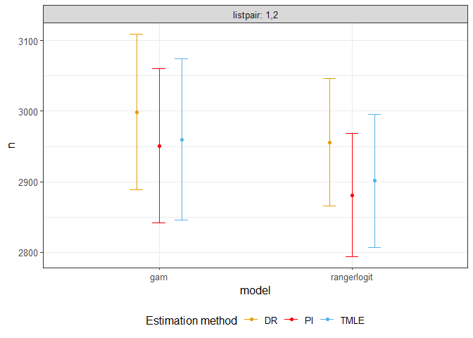

<!-- README.md is generated from README.Rmd. Please edit that file -->

# drpop

<!-- badges: start -->

<!-- badges: end -->

The goal of drpop is to provide users doubly-robust and efficient
estimates of population size and the variances for a capture-recapture
problem.

## Installation

You can install the released version of drpop from
[CRAN](https://CRAN.R-project.org) with:

``` r
install.packages("drpop")
```

And the development version from [GitHub](https://github.com/) with:

``` r
# install.packages("devtools")
devtools::install_github("mqnjqrid/drpop")
```

## Example

This is a basic example which shows you how to solve a common problem:

``` r
library(drpop)
#> 
#> Attaching package: 'drpop'
#> The following object is masked from 'package:graphics':
#> 
#>     plot
#> The following object is masked from 'package:base':
#> 
#>     plot

n = 1000
x = matrix(rnorm(n*3, 2, 1), nrow = n)
expit = function(xi) {
  exp(sum(xi))/(1 + exp(sum(xi)))
}
y1 = unlist(apply(x, 1, function(xi) {sample(c(0, 1), 1, replace = TRUE, prob = c( 1 - expit(-0.6 + 0.4*xi), expit(-0.6 + 0.4*xi)))}))
y2 = unlist(apply(x, 1, function(xi) {sample(c(0, 1), 1, replace = TRUE, prob = c( 1 - expit(-0.6 + 0.3*xi), expit(-0.6 + 0.3*xi)))}))
datacrc = cbind(y1, y2, exp(x/2))

options(warn = -1)
estim <- psinhat(List_matrix = datacrc, func = c("logit"), nfolds = 2, K = 2)
#> Loading required package: tidyverse
#> -- Attaching packages ----- tidyverse 1.3.0 --
#> v ggplot2 3.3.2     v purrr   0.3.4
#> v tibble  3.0.3     v dplyr   1.0.1
#> v tidyr   1.1.1     v stringr 1.4.0
#> v readr   1.3.1     v forcats 0.5.0
#> -- Conflicts -------- tidyverse_conflicts() --
#> x dplyr::filter() masks stats::filter()
#> x dplyr::lag()    masks stats::lag()
# The population size estimates are obtained by
estim$n
#>     logit.PI logit.DR logit.TMLE
#> 1,2 996.5305 1011.199   990.0618
# The corresponding variances are
estim$varn
#>     logit.PI logit.DR logit.TMLE
#> 1,2 958.9848 980.8106   1019.683
## basic example code
```

The following shows the confidence interval of estimates for a toy data.
Real population size is 3000.

``` r
library(drpop)

n = 3000
x = matrix(rnorm(n*3, 2,1), nrow = n)

expit = function(xi) {
  exp(sum(xi))/(1 + exp(sum(xi)))
}
y1 = unlist(apply(x, 1, function(xi) {sample(c(0, 1), 1, replace = TRUE, prob = c( 1 - expit(-0.6 + 0.4*xi), expit(-0.6 + 0.4*xi)))}))
y2 = unlist(apply(x, 1, function(xi) {sample(c(0, 1), 1, replace = TRUE, prob = c( 1 - expit(-0.6 + 0.3*xi), expit(-0.6 + 0.3*xi)))}))
datacrc = cbind(y1, y2, exp(x/2))

estim <- psinhat(List_matrix = datacrc, func = c("logit", "sl"), nfolds = 2, eps = 0.01)

plot(psinhat = estim)$g1
```



``` r
#result = melt(as.data.frame(estim), variable.name = "estimator", value.name = "population_size")
#ggplot(result, aes(x = population_size - n, fill = estimator, color = estimator)) +
#  geom_density(alpha = 0.4) +
#  xlab("Bias on n")
```

The following shows confidence interval of estimates for toy data with a
categorical covariate. Real population size is 10000.

``` r
library(drpop)
n = 10000
x = matrix(rnorm(n*3, 2, 1), nrow = n)
expit = function(xi) {
  exp(sum(xi))/(1 + exp(sum(xi)))
}
ss = sample(c('m','f'), n, replace = TRUE, prob = c(0.45, 0.55))

y1 = unlist(apply(x, 1, function(xi) {sample(c(0, 1), 1, replace = TRUE, prob = c( 1 - expit(-0.6 + 0.4*xi), expit(-0.6 + 0.4*xi)))}))
y2 = sapply(1:n, function(i) {sample(c(0, 1), 1, replace = TRUE, prob = c( 1 - expit(-0.6 + 0.3*(ss[i] == 'm') + 0.3*x[i,]), expit(-0.6 + 0.3*(ss[i] == 'm') + 0.3*x[i,])))})
datacrc = cbind.data.frame(y1, y2, exp(x/2), ss)

p = psinhatcond(List_matrix = datacrc, condvar = 'ss')
summary = plot(psinhatcond = p)
summary$g2 + geom_hline(yintercept = table(ss), color = "brown", linetype = "dashed")
```


